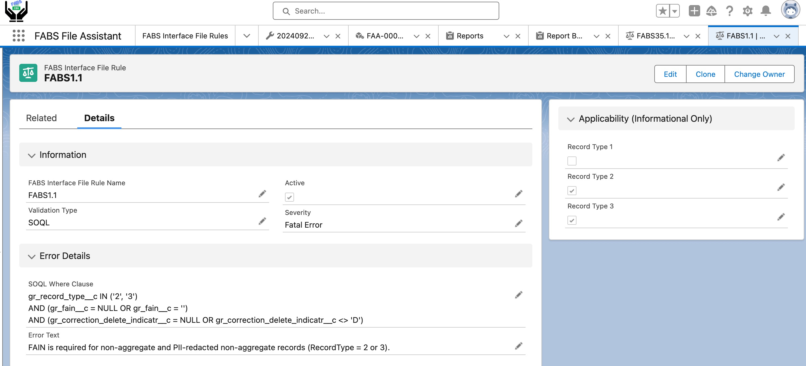
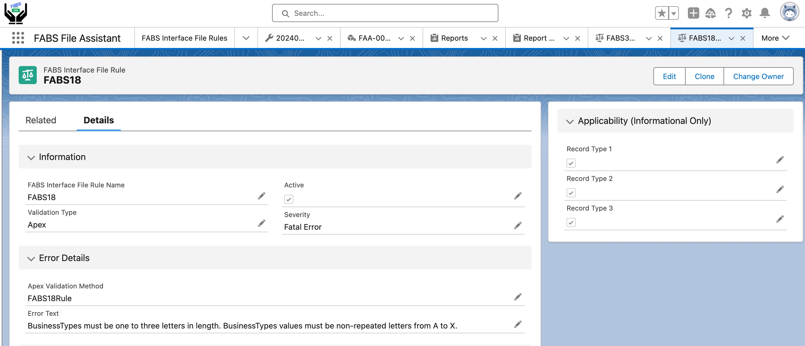
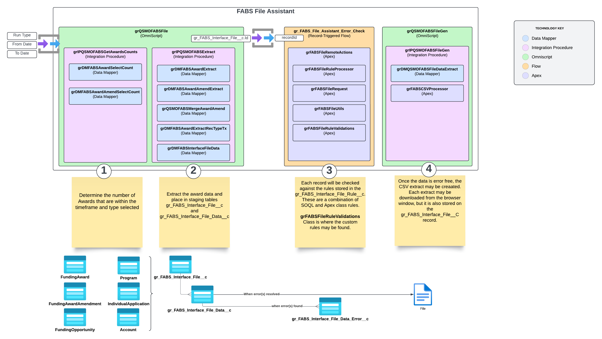
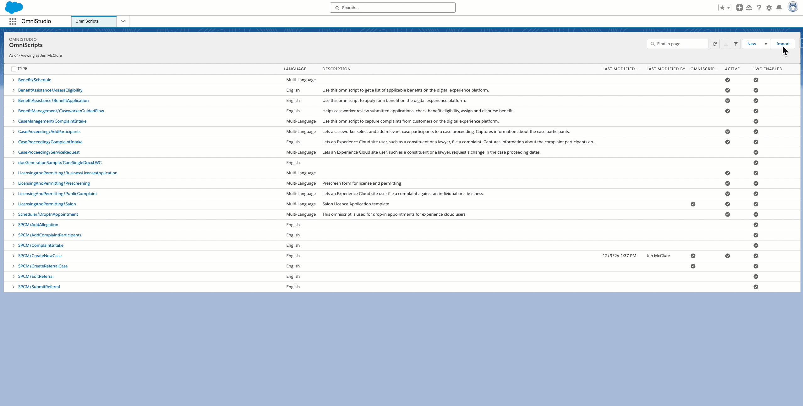
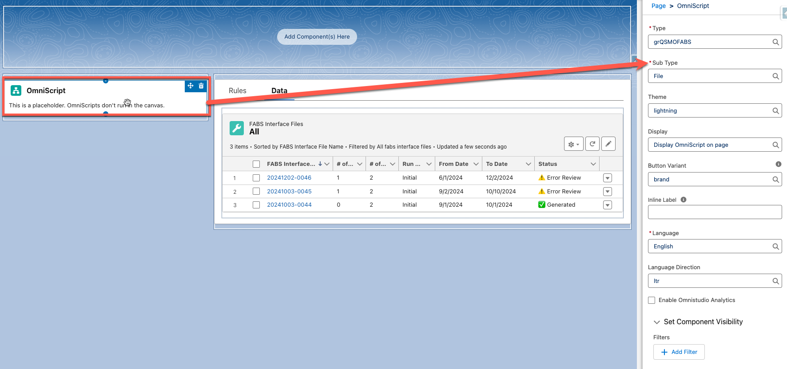
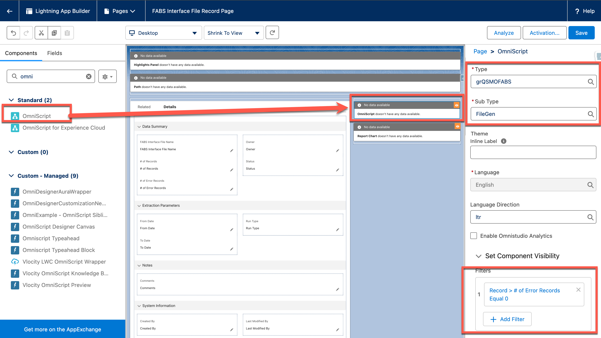

# FABS File Assistant

The FABS (Financial Assistance Broker Submission) file is a reporting format used by U.S. federal agencies and recipients to report financial assistance data, specifically grants, loans, cooperative agreements, and other types of financial assistance. It is part of the DATA Act (Digital Accountability and Transparency Act) reporting requirements, which aim to increase transparency and accountability in federal spending.

The FABS File Assistant provides a mechanism, assuming you are using the Public Sector Solutions Grantmaking module and have installed the Grantmaking FIBF Data Model accelerator, to determine how your data aligns with the GSDM (Governmentwide Spending Data Model) Validation Rules (as of 4/11/2024). 

Accelerator Listing: [insert url to the public listing on the Accelerator site](https://gpsaccelerators.developer.salesforce.com/) (tbd once published)

## Description

The Validation Rules that are incorporated within this accelerator provide a combination of SOQL and Apex validations for the majority of the rules that were available at the time this accelerator was published. The SOQL rules are configurable via the Salesforce UI, so that these may be updated, as required, to meet any future requirements, as shown below:

For rules that require more advance capabilities, Apex methods may be added/modified in the grFABSFileRuleValidations Apex class to accommodate those requirements.  

The data for the FABS Interface File Rules object is provided as part of this accelerator as a baseline for you to upload as a starting point.  

In addition, upon installation of the FABS File Assistant, you have the following components to assist you in creating the CSV (Comma-Separated Values) file required to upload to FABS.  The diagram represents how these components work to gather the data, perform an initial error validation, and then generate the extract data in a CSV file.

## Included Assets

This Accelerator includes the following assets:
<ol>
  <li>An <strong>unmanaged package</strong> (link below; metadata is also found in the /force-app/main/default/ folder) that includes:
    <ul>
      <li>Custom objects (x4)</li>
      <li>Flow (x1)</li>
      <li>Apex Classes (x12)</li>
      <li>App (x1)</li>
      <li>Permission Set (x1)</li>
    </ul>
  </li>
  <li><strong>OmniScripts</strong> (x2) located in the /datapacks/ folder</li>
  <ul>
    <li>grQSMOFABSFile</li>
    <li>grQSMOFABSFileGen</li>
  </ul>
  <li><strong>Documentation</strong>, including:
    <ul>
      <li>This readme file</li>
      <li>Detailed instructions located in the /docs/ folder</li>
    </ul>
  </li>
</ol>

## Before You Install

**License Requirements** 
* Public Sector Fondations - Advanced

**Accelerator or Technology-Specific Assumptions** 
* Grantmaking FIBF Data Model (https://gpsaccelerators.developer.salesforce.com/accelerator/a0wDo0000022Ha1IAE/grantmaking-fibf-data-model) is Required
* OmniStudio 252.6 or later must be installed

**General Assumptions** 
* You are using this Accelerator in a sandbox or test environment. It is recommended that you not install any Accelerator directly into production environments.
* If you do not have a Salesforce org licensed to you, you may try Public Sector Solutions for free with one of our [trial environments](https://developer.salesforce.com/free-trials/comparison/public-sector).
* You are using this Accelerator in conjunction with the Salesforce Lightning Experience (LEX) - not the Classic UI.

## Installation

* Install the unmanged package: https://test.salesforce.com/packaging/installPackage.apexp?p0=04tHs0000017RD9
* Import and Activate the OmniStudio Data Packs from the /datapacks directory:
* * grQSMOFABSFile

 

* * grQSMOFABSFileGen - before Activation of this Omniscript follow these steps:
  *      Open the grQSMOFABSFileGen OmniScript
        * Open the GenerateFABSCSVFile Step
        * Click the TextBlock1 text box, edit the text box
        * Double-click the image and click the image button to open the properties
        * Change the Image list dropdown to usaspendinglogo.png
        * Click Save, Save and then Activate Version

## Post-Install Setup & Configuration

* Add the FABS File Assistant Admin permission set to the appropriate user(s).
* Add the Omniscript component to the FABS File Assistant Page:

* Add the OmniScript component to the FABS Interface File Record Page:

* Import Rules - Use DataLoader or Import Wizard to load the [gr_FABS_Interface_File_Rules.csv](docs/gr_FABS_Interface_File_Rules.csv) file into gr_FABS_Interface_File_Rule__c object.

## FAQs

**_Q: Do I have to import the CSV file into gr_FABS_Interface_File_Rule__c object?_**

A: If you want the base rules, then yes.  Otherwise you will need build the rules manually.

**_Q: Were new fields added to the FIBF Data Model?_**

A: A field name gr_FABS_Interface_File_Status__c was added to both the Funding Award and Funding Award Amendment to capture the status of the Funding Award with regard to the FABS File creation.

## Additional Resources

* User Instructions [User Instructions](<docs/FABS File Assistant Accelerator User Instructions.pdf>)
* The information used to develop this accelerator was based on the Governmentwise Spending Data Model (GSDM) and may be found on the Bureau of the Fiscal Service website https://fiscal.treasury.gov/data-transparency/GSDM-current.html

## Revision History

<strong>1.1 Initial release (31 Dec 2024)</strong> - Initial Release, instructions in culded 

## Acknowledgements

## Terms of Use

Thank you for using Global Public Sector (GPS) Accelerators.  Accelerators are provided by Salesforce.com, Inc., located at 1 Market Street, San Francisco, CA 94105, United States.

By using this site and these accelerators, you are agreeing to these terms. Please read them carefully.

Accelerators are not supported by Salesforce, they are supplied as-is, and are meant to be a starting point for your organization. Salesforce is not liable for the use of accelerators.

For more about the Accelerator program, visit: [https://gpsaccelerators.developer.salesforce.com/](https://gpsaccelerators.developer.salesforce.com/)
